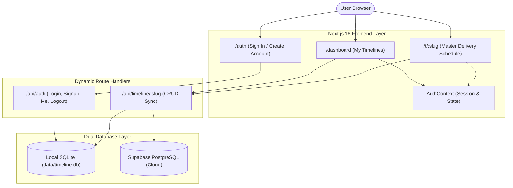
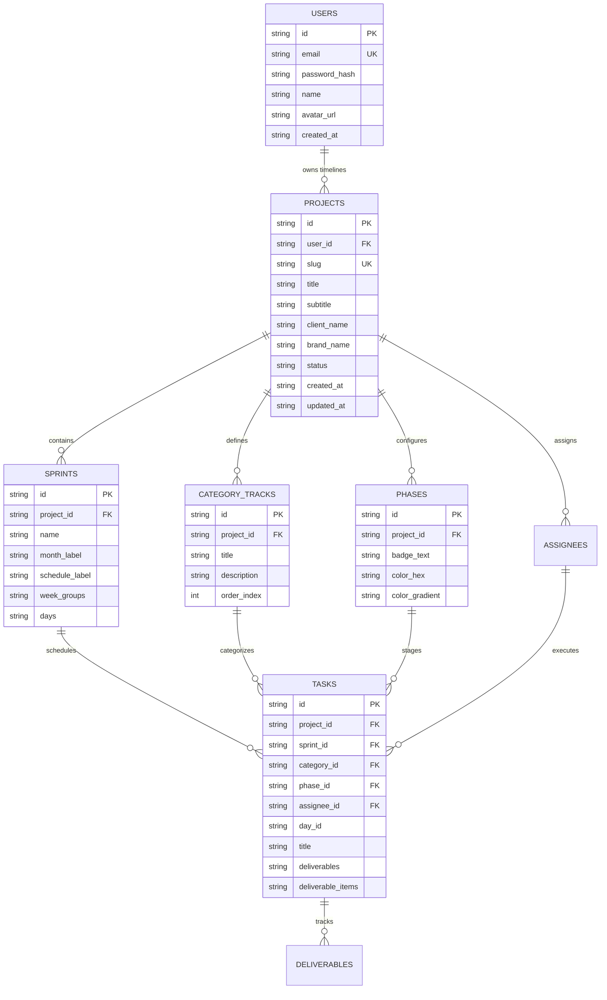

# Project Context & Single Source of Truth

> **OmniGate AI Context File**  
> Living blueprint for **Weekline** — Simple, Streamlined Sprint Timeline Platform.

---

## 1. Project Overview

| Property | Value |
|---|---|
| **Project Name** | **Weekline** |
| **Workspace Model** | User-First Personal Workspace (Multi-Week Delivery Schedules) |
| **Primary Framework** | Next.js 16 (App Router) + React 19 + TypeScript |
| **Styling Engine** | Tailwind CSS v4 + Clean White / Light Theme Design Tokens |
| **Database Architecture** | Dual Database Engine: SQLite (Local) + Supabase PostgreSQL (Cloud) |
| **Core Paradigm** | Simple, focused Multi-Week Timeline Grid with Sticky Headers & Auth Guard |

---

## 2. System Architecture

---

## 3. Database Schema (ERD)

---

## 4. Key Rules & Governance

1. **Simplicity First**: No organization complexity, no roles, no favorite hearts. Just clean personal timelines.
2. **Authentication & Route Guard**: Non-logged in users visiting `/dashboard` or `/` are redirected to `/auth`.
3. **Zero Dummy Data**: No hardcoded mock users or placeholder projects.
4. **Clean Light / White Aesthetic**: High-contrast slate typography and vibrant stage badges.
